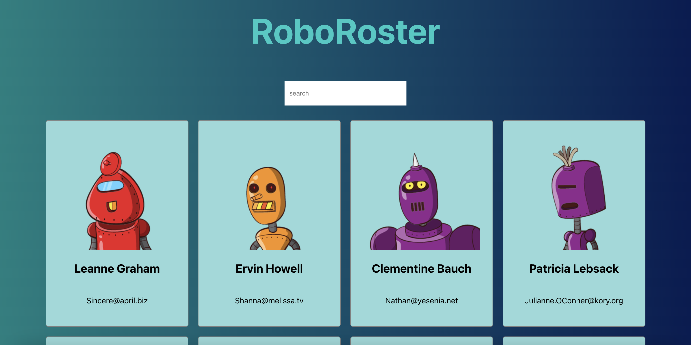

# RoboRoster

RoboRoster is a single-page web app is setuped with React + Vite, that cover the basic concepts of React.

## Features

- Card
- Card List
- Search Box

## Tech Stack

- **React Basics** 
- **JavaScript**
- **CSS** 

## App Demo



## Recommended IDE Setup

For an optimized development experience, refer to the [Vue Docs Scaling Up Guide](https://vuejs.org/guide/scaling-up/tooling.html#ide-support).

## Project Setup

### Install Dependencies

```sh
pnpm install
```

### Run in Development Mode

```sh
pnpm dev
```

### Build for Production

```sh
pnpm build
```

## References

- [Vite Documentation](https://vite.dev/){:target="_blank"}
- [React.js Documentation](https://react.dev/){:target="_blank"}
